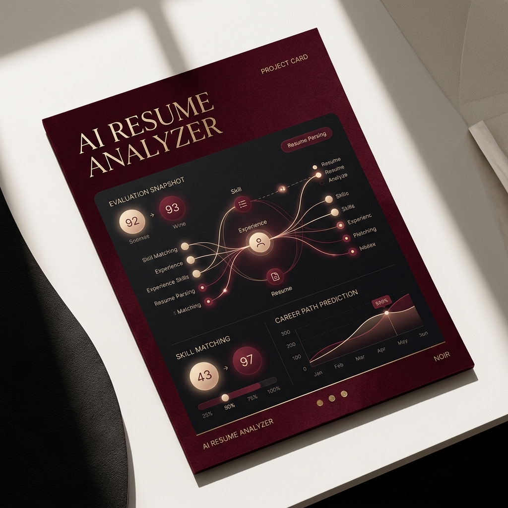
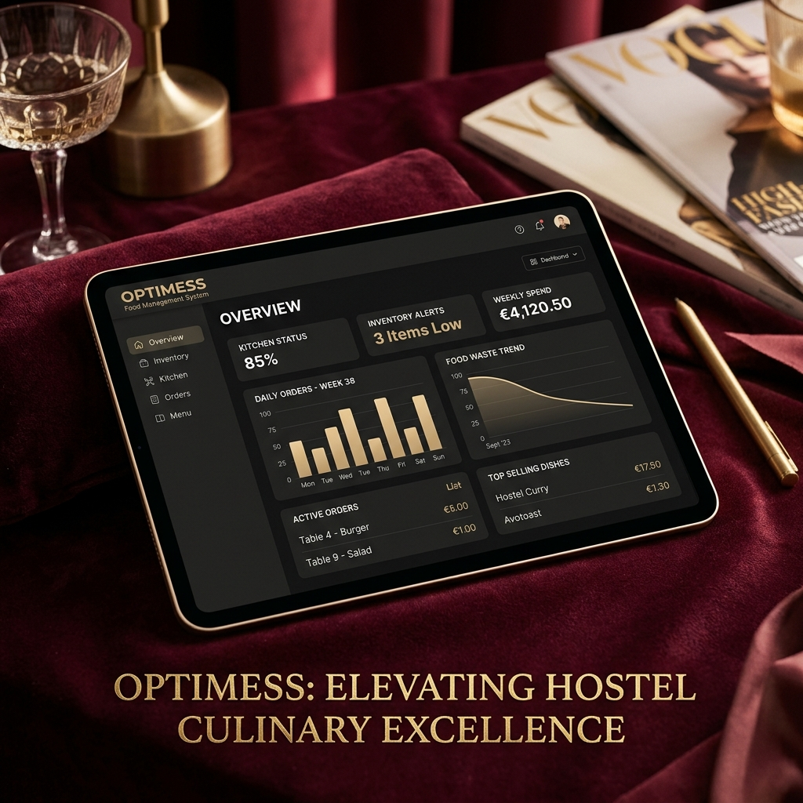
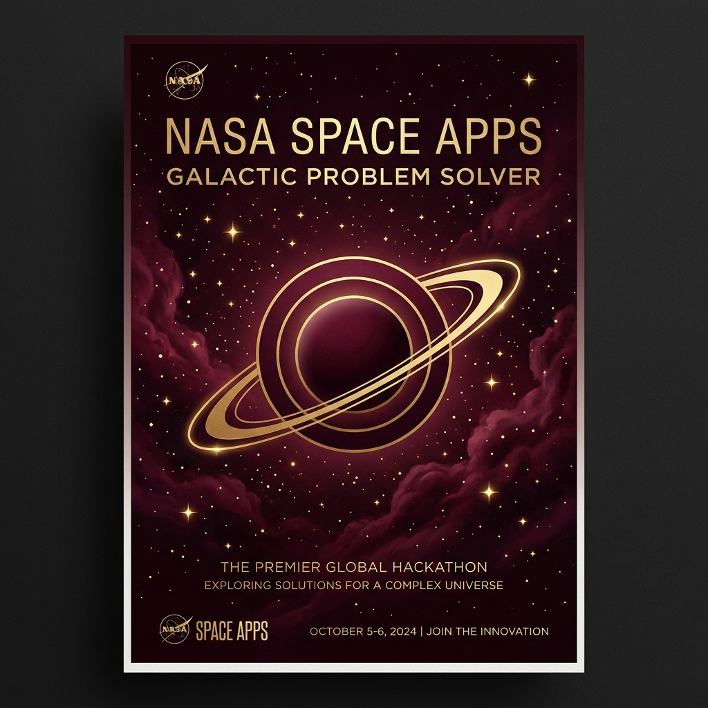

<div align="center">

# ✦ AMRITHA SANJIV ✦
### *Editorial Luxury Portfolio • Full-Stack Web & AI Engineering*

[](https://amrithasanjiv.github.io/portfolio/)
[](https://github.com/Amrithasanjiv)
[](https://linkedin.com/in/amritha-sanjiv)
[](mailto:sanjivamritha@gmail.com)

<p align="center">
  <a href="https://amrithasanjiv.github.io/portfolio/"><b>🌐 View Live Website</b></a> •
  <a href="https://amrithasanjiv.github.io/portfolio/#work"><b>💼 Selected Work</b></a> •
  <a href="https://amrithasanjiv.github.io/portfolio/#demo"><b>🤖 Live AI Demo</b></a> •
  <a href="https://amrithasanjiv.github.io/portfolio/#contact"><b>📫 Get in Touch</b></a>
</p>

---

</div>

## 📖 Overview

A bespoke, high-fashion editorial portfolio website for **Amritha Sanjiv**, B.Tech Computer Science & Engineering student at St. Joseph's College of Engineering and Technology, Palai (KTU CGPA: 7.55). 

The portfolio bridges modern, disciplined full-stack web engineering with applied artificial intelligence and machine learning, designed with a distinctive **Burgundy Velvet & Cream Parchment** magazine editorial visual aesthetic.

---

## 📸 Highlights & Showcase

| AI Resume Analyzer | OPTIMESS Hostel Food System | Space Apps Challenge |
| :---: | :---: | :---: |
|  |  |  |
| *NLP & ML Classification* | *Full-Stack Django Platform* | *NASA Space Apps Solver* |

---

## ✨ Key Features

- **🎨 High-Fashion Editorial Luxury Design**:
  - Curated color scheme: Deep Velvet Burgundy (`#220810`), Cream Parchment (`#f6eee5`), Crimson Glow (`#a62a42`), and Vintage Champagne Gold (`#dfb08c`).
  - Distinctive dual-tone editorial typography pairing *Playfair Display* and *Cormorant Garamond* with clean, readable modern *Plus Jakarta Sans*.

- **🤖 Live Interactive AI Resume Classifier**:
  - Live in-browser demonstration simulating NLP tokenization, TF-IDF vector feature extraction, and Multinomial Naive Bayes probabilistic inference.
  - Interactive test presets for Machine Learning, Full-Stack, Backend, and Data Science domains with real-time probability confidence bars.

- **📄 Printable & Viewable Resume Modal**:
  - High-resolution modal with complete academic background, experience at IPSR Solutions Ltd. & NSRY Kochi, projects, and certifications.
  - One-click `@media print` optimized layout ready to save directly as PDF or print on letterhead.

- **📬 Connected Contact Form & Message Inbox**:
  - Integrated with **FormSubmit** for zero-backend email delivery directly to `sanjivamritha@gmail.com`.
  - Built-in on-page **Messages Inbox** with real-time badge counters, localStorage backup, sender email reply shortcuts, and message deletion.

- **📱 Fluid Responsiveness & Performance**:
  - Mobile-first breakpoints adapting from 4K ultrawide monitors down to smartphones.
  - Zero external heavyweight framework dependencies (pure semantic HTML5, Vanilla CSS3, Vanilla ES6+ JavaScript) ensuring sub-second load times.

---

## 🛠️ Tech Stack & Architecture

### **Core Frontend**


### **Backend & Machine Learning Expertise (Featured in Projects)**


---

## 📂 Repository Structure

```text
portfolio/
├── index.html                   # Semantic markup, meta tags, and structured sections
├── README.md                    # Project documentation & engineering overview
├── .gitignore                   # Git ignore patterns
└── assets/
    ├── css/
    │   ├── style.css            # Editorial design system, tokens, and components
    │   └── responsive.css       # Fluid responsive breakpoints and print stylesheet
    ├── js/
    │   ├── main.js              # Navigation, scroll observers, and micro-interactions
    │   └── interactive.js       # Resume modal, AI simulator, contact form & inbox
    └── images/
        ├── amritha.jpg          # Editorial portrait photo
        ├── project-resume.jpg   # AI Resume Analyzer showcase asset
        ├── project-optimess.jpg # OPTIMESS full-stack platform showcase asset
        ├── project-spaceapps.jpg# NASA Space Apps Challenge asset
        └── design_ref.jpg       # Design reference & inspiration moodboard
```

---

## 🎨 Design System & Palette

| Token | Hex | Role |
| :--- | :--- | :--- |
| `--bg-noir` | `#0b0306` | Deep Noir Background Canvas |
| `--bg-burgundy` | `#220810` | Signature Rich Burgundy Velvet |
| `--cream-parchment` | `#f6eee5` | Editorial Light Content Block |
| `--accent-crimson` | `#a62a42` | Primary Interactive Call-To-Action |
| `--accent-gold` | `#dfb08c` | Champagne Gold Accents & Highlights |
| `--accent-rose` | `#d67a8b` | Subtle Highlight Accents |

---

## 🚀 Local Development Setup

To run and preview this portfolio locally on your machine:

1. **Clone the repository:**
   ```bash
   git clone https://github.com/Amrithasanjiv/portfolio.git
   cd portfolio
   ```

2. **Start a local development server:**
   Using Python:
   ```bash
   python -m http.server 8080
   ```
   *(Or using Node `npx serve`, or the VS Code "Live Server" extension).*

3. **Open in your browser:**
   ```text
   http://localhost:8080
   ```

---

## 📬 Contact & Connect

- **Portfolio:** [amrithasanjiv.github.io/portfolio](https://amrithasanjiv.github.io/portfolio/)
- **Email:** [sanjivamritha@gmail.com](mailto:sanjivamritha@gmail.com)
- **LinkedIn:** [linkedin.com/in/amritha-sanjiv](https://linkedin.com/in/amritha-sanjiv)
- **GitHub:** [github.com/Amrithasanjiv](https://github.com/Amrithasanjiv)
- **Location:** Kollam, Kerala, India

---

<div align="center">
  <sub>© 2026 Amritha Sanjiv. Crafted with Burgundy & Cream Editorial Luxury.</sub>
</div>
